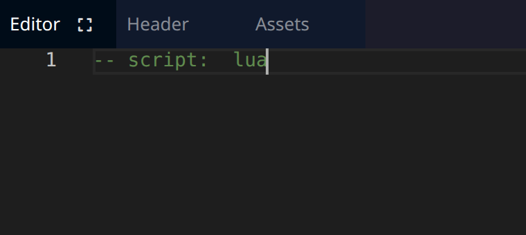
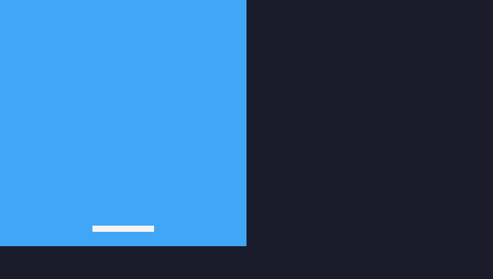

# Prise en main de TIC-80

TIC-80 est une « fantasy console » rétro et open source, conçue pour créer, jouer et partager de petits jeux. Prends quelques instants pour la découvrir en testant un jeu : [https://tic80.com/play](https://tic80.com/play)

## Prendre en main l'environnement

### Lance l'environnement
<!-- ws:doit -->

**Ton objectif :**
- Ouvre l'environnement TIC-80 en cliquant sur le bouton **Ouvrir TIC-80** qui se trouve en bas à droite de ton écran.
  <!-- ws:cue runtime -->
- Clique ensuite dans le panneau **TIC-80** sur « Click to play » pour démarrer ton environnement.


## Initialiser TIC-80 pour pouvoir utiliser le langage Lua

Il te suffit de taper la commande suivante dans le panneau **TIC-80** :

```bash
new lua
```

<!-- ws:toolbox -->
> 🧰 **Outil #1 : `new lua` « Initialiser un projet en Lua dans TIC-80 »**
> Taper `new lua` dans la console permet d'indiquer que tu souhaites faire ton projet en Lua. TIC-80 est capable d'utiliser d'autres langages de programmation, comme Python ou JavaScript.
<!-- /ws:toolbox -->

## Reset “hello world”

Le plus simple pour bien comprendre le fonctionnement de TIC-80 consiste à partir d’un environnement vierge : tu vas donc supprimer tous les éléments de la démo.

### Mise en application
<!-- ws:doit -->

- Après avoir initialisé ton projet en Lua, rends-toi dans le panneau **Editor** et supprime tout le code **après** `-- script:  lua`.



<!-- ws: {type: quiz, id: init-cmd, title: "Créer un projet Lua", kind: single, points: 10} -->
> Quelle commande initialise un projet Lua dans TIC-80 ?

- A. init lua
- B. new lua
- C. start lua

## Affichage du pad et de l’écran de jeu

Ici tu vas taper tes premières lignes de code dans TIC-80.


<!-- ws:toolbox -->
> 🧰 **Outil #2 : `cls()` « efface l'écran »**
> Moyen mnémotechnique : **CL**ear **S**creen
> 🧰 **Outil #3 : `rect()` « dessine un rectangle sur l'écran »**
> Les valeurs entre les parenthèses permettent de préciser la position, les dimensions et la couleur du rectangle
<!-- /ws:toolbox -->


### Mise en application
<!-- ws:doit -->

Écris le code initial dans l'éditeur :
```lua
function TIC()
 cls()
 rect(0,0,120,120,10)
 rect(45, 110, 30, 3, 12)
end
```

<details>
    <summary>Explications</summary>

- La partie principale du programme se déclare de la façon suivante `function TIC()` et se termine par `end`

- En Lua, l'espace au début de chaque ligne n'est pas obligatoire, mais il rend le code plus facile à lire : garde-le, comme dans le code ci-dessus.

- Les instructions entre `function TIC()` et `end` s'exécutent dans l'ordre : effacer l'écran, dessiner un rectangle, dessiner un autre rectangle

</details>

Pour lancer ton code :
- Clique dans le panneau TIC-80
- Tape la commande `run` **ou** utilise `Ctrl`+`Entrée`



<!-- ws: {type: quiz, id: cls-role, title: "Le rôle de cls()", kind: single, points: 10} -->
> À quoi sert la fonction `cls()` dans notre programme TIC-80 ?

- A. À calculer le score du joueur
- B. À dessiner un rectangle
- C. À effacer l'écran
- D. À lancer le programme

<!-- ws: {type: quiz, id: tic-rect, title: "La fonction rect()", kind: single, points: 10} -->
> Que fait la fonction `rect()` ?
- A. Dessine un cercle
- B. Dessine un triangle
- C. Dessine un rectangle
- D. Cette fonction ne fait rien

<!-- ws: {type: quiz, id: rect-order, title: "L'ordre des rectangles", kind: single, points: 10} -->
> Que se passerait-il si les lignes `rect(0, 0, 120, 120, 10)` et `rect(45, 110, 30, 3, 12)` étaient inversées ?
- A. Les rectangles sont dessinés dans un ordre différent : le rectangle bleu est dessiné après le rectangle blanc, qui n'est plus visible
- B. Le programme se comporte exactement comme avant, rien n'a changé
- C. Le programme plante et une erreur s'affiche
- D. Des cercles s'affichent à l'écran à la place des rectangles
